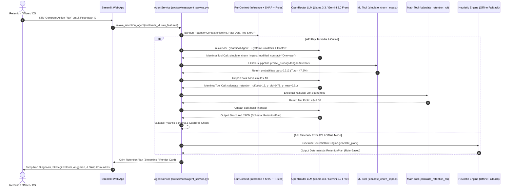
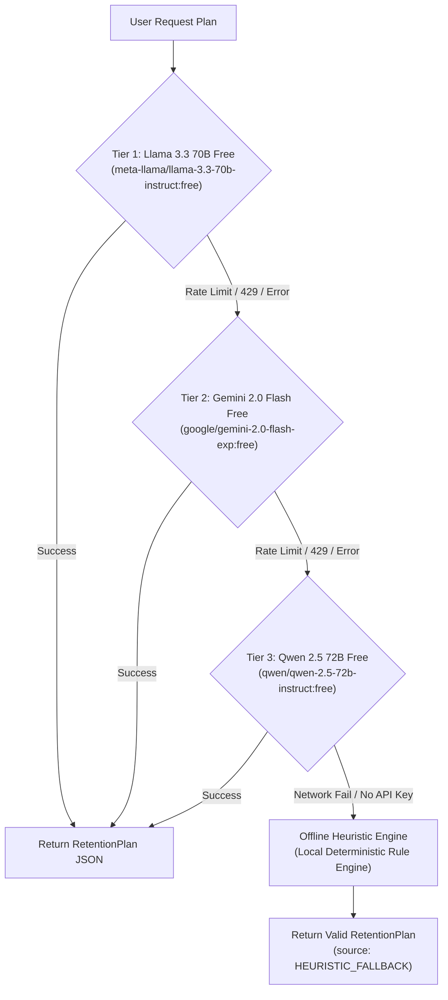

# Implementation & Evaluation Harness Plan: Agentic AI Retention Copilot

**Project:** Telco Customer Churn Intelligent Retention Platform (Phase 2)  
**Author:** Antigravity AI & Arfiadi  
**Status:** Approved Technical Implementation Plan  
**Target Architecture:** PydanticAI + OpenRouter (Free Tier) + Scikit-Learn/LightGBM Tool Calling  
**Language Environment:** Python 3.10+ | Scikit-Learn | Pydantic v2 | PydanticAI | Streamlit  

---

## 1. Executive Summary & Philosophy of the "Harness"

Model prediktif murni (seperti LightGBM pada Fase 1) hanya mampu menjawab: *"Berapa probabilitas pelanggan ini akan churn?"* dan *"Fitur apa yang berkontribusi?"* (via SHAP). Namun, dalam operasional bisnis telekomunikasi nyata, tim *Customer Success* membutuhkan **tindakan intervensi presisi**:
1. Menemukan akar permasalahan spesifik pelanggan (*Root Cause Diagnosis*).
2. Memilih penawaran retensi yang paling menguntungkan (*Profit-Optimal Offer*).
3. Memastikan biaya insentif tidak melampaui margin penghematan (*Budget Guardrail* $\le \$20$).
4. Mengukur dampak intervensi sebelum penawaran diberikan (*Counterfactual What-If Simulation*).
5. Menghasilkan naskah penawaran personal bernada empati (*Outreach Copywriting*).

### Mengapa Memerlukan "Harness"?
Dalam pengembangan agen kecerdasan buatan (*Agentic AI*), LLM bersifat non-deterministik dan rentan berhalusinasi jika dibiarkan tanpa kontrol. Konsep **Harness** pada dokumen ini mencakup 4 pilar rekayasa perangkat lunak ketat:
* **Schema Contract Harness**: Setiap input, dependency context, alat (*tool*), dan output agen diikat oleh skema Pydantic v2 yang ketat (*Type-safe & Zero runtime ambiguity*).
* **Deterministic Tool Harness**: Agen tidak diizinkan "menebak" atau "berkhayal" tentang probabilitas churn baru atau ROI finansial. Agen **wajib** memanggil pipeline model Scikit-Learn/LightGBM asli untuk menghitung simulasi.
* **Safety & Budget Guardrail Harness**: Validasi terprogram yang memblokir penawaran jika diskon melebihi pagu unit economics ($\le \$20.00$) atau jika rekomendasi bertentangan dengan profil pelanggan.
* **Resilience & Fallback Harness**: Mekanisme *Zero-Downtime Guarantee* dengan *Multi-Model Fallback Ladder* (OpenRouter Free Tier) dan *Offline Deterministic Heuristic Engine* lokal saat ketiadaan koneksi internet atau kuota API habis.

---

## 2. End-to-End Agentic Control Flow & Architecture

Sistem mengadopsi pola **Closed-Loop Counterfactual Decisioning** dengan *Dependency Injection* via PydanticAI:



---

## 3. Pydantic Contracts & Schema Specifications

Seluruh kontrak data diletakkan di `src/services/schemas.py` untuk menjamin konsistensi antara Layer Presentasi, Layer Servis, dan LLM Agent.

### 3.1. Customer Profile Input Schema (`CustomerProfile`)
```python
from pydantic import BaseModel, Field
from typing import Optional

class CustomerProfile(BaseModel):
    customer_id: Optional[str] = Field("CUST-UNKNOWN", description="Unique customer identifier")
    gender: str = Field(..., regex="^(Male|Female)$")
    SeniorCitizen: int = Field(..., ge=0, le=1)
    Partner: str = Field(..., regex="^(Yes|No)$")
    Dependents: str = Field(..., regex="^(Yes|No)$")
    tenure: int = Field(..., ge=0, le=100, description="Months with company")
    PhoneService: str = Field(..., regex="^(Yes|No)$")
    MultipleLines: str = Field(..., regex="^(Yes|No|No phone service)$")
    InternetService: str = Field(..., regex="^(DSL|Fiber optic|No)$")
    OnlineSecurity: str = Field(..., regex="^(Yes|No|No internet service)$")
    OnlineBackup: str = Field(..., regex="^(Yes|No|No internet service)$")
    DeviceProtection: str = Field(..., regex="^(Yes|No|No internet service)$")
    TechSupport: str = Field(..., regex="^(Yes|No|No internet service)$")
    StreamingTV: str = Field(..., regex="^(Yes|No|No internet service)$")
    StreamingMovies: str = Field(..., regex="^(Yes|No|No internet service)$")
    Contract: str = Field(..., regex="^(Month-to-month|One year|Two year)$")
    PaperlessBilling: str = Field(..., regex="^(Yes|No)$")
    PaymentMethod: str = Field(..., regex="^(Electronic check|Mailed check|Bank transfer \(automatic\)|Credit card \(automatic\))$")
    MonthlyCharges: float = Field(..., ge=10.0, le=200.0)
    TotalCharges: float = Field(..., ge=0.0, le=10000.0)
```

### 3.2. Diagnostic Context Schema (`CustomerDiagnostic`)
```python
class SHAPFactor(BaseModel):
    feature_name: str
    feature_value: str
    shap_value: float
    impact_type: str = Field(..., regex="^(RISK_DRIVER|RETENTION_ANCHOR)$")
    human_explanation: str

class CustomerDiagnostic(BaseModel):
    customer: CustomerProfile
    baseline_churn_prob: float
    decision_threshold: float = 0.39
    is_at_risk: bool
    top_risk_drivers: list[SHAPFactor]
    top_retention_anchors: list[SHAPFactor]
```

### 3.3. Pre-Approved Retention Catalog Schema (`RetentionPerk`)
```python
class RetentionPerk(BaseModel):
    perk_id: str
    name: str
    description: str
    cost_usd: float = Field(..., le=20.0, description="Cost must not exceed unit economic margin")
    feature_patch: dict[str, str | float] = Field(..., description="Feature transformation simulated in ML model")
    target_drivers: list[str] = Field(..., description="SHAP features addressed by this perk")
```

### 3.4. Final Output Schema (`RetentionPlan`)
```python
from pydantic import BaseModel, Field

class RetentionPlan(BaseModel):
    root_cause_diagnosis: str = Field(
        ..., 
        description="Ringkasan 2 kalimat tentang akar penyebab risiko churn berdasarkan nilai SHAP tertinggi."
    )
    recommended_package_name: str = Field(
        ..., 
        description="Nama program retensi resmi yang ditawarkan kepada pelanggan."
    )
    incentive_cost_usd: float = Field(
        ..., 
        le=20.0, 
        description="Total biaya program/diskon untuk perusahaan (wajib <= $20.00)."
    )
    simulated_churn_prob: float = Field(
        ..., 
        description="Probabilitas churn baru hasil komputasi pipeline ML setelah modifikasi fitur."
    )
    risk_reduction_pct: float = Field(
        ..., 
        description="Persentase penurunan risiko churn: ((P_old - P_new) / P_old) * 100%."
    )
    projected_net_value_usd: float = Field(
        ..., 
        description="Estimasi nilai keuntungan bersih yang diselamatkan perusahaan melalui intervensi ini."
    )
    outreach_script: str = Field(
        ..., 
        description="Naskah percakapan empati dan persuasif untuk staf retensi via telepon atau WhatsApp."
    )
    confidence_level: str = Field(
        ..., 
        regex="^(HIGH|MEDIUM|LOW)$", 
        description="Tingkat kepercayaan agen terhadap keberhasilan rencana berdasarkan data."
    )
    generation_source: str = Field(
        "OPENROUTER_AGENT", 
        regex="^(OPENROUTER_AGENT|HEURISTIC_FALLBACK)$",
        description="Sumber eksekusi strategi: Live AI atau Fallback Rule Engine."
    )
```

---

## 4. Agent Tool Harness Specification

Agen PydanticAI dibekali 3 fungsi alat (*tools*) deterministik yang memanfaatkan model terlatih dan formula matematika riil.

### Tool 1: `simulate_churn_impact`
* **File:** `src/services/agent_tools.py`
* **Deskripsi:** Menerapkan modifikasi fitur hipotetis (*what-if*) pada pelanggan dan menjalankan model `telco_churn_lgbm_pipeline.joblib` untuk mendapatkan probabilitas churn baru.
* **Signature:**
  ```python
  def simulate_churn_impact(
      ctx: RunContext[RetentionContext],
      feature_modifications: dict[str, Any]
  ) -> dict[str, float]:
      """
      Eksekusi pipeline LightGBM pada profil pelanggan yang dimodifikasi.
      Returns: {'new_churn_prob': float, 'absolute_drop': float, 'relative_drop_pct': float}
      """
  ```

### Tool 2: `calculate_retention_roi`
* **File:** `src/services/agent_tools.py`
* **Deskripsi:** Menghitung *Expected Net Value* retensi berdasarkan matriks *Unit Economics*:
  $$\Delta E[V] = (\Delta P(\text{churn}) \times \text{CLV}) - C$$
  di mana $\text{CLV} = \text{MonthlyCharges} \times 12$ bulan dan $C \le \$20$.
* **Signature:**
  ```python
  def calculate_retention_roi(
      monthly_charges: float,
      current_prob: float,
      new_prob: float,
      incentive_cost: float
  ) -> dict[str, float]:
      """
      Menghitung kelayakan finansial intervensi retensi.
      Returns: {'saved_clv': float, 'cost': float, 'net_expected_profit': float, 'is_profitable': bool}
      """
  ```

### Tool 3: `get_eligible_retention_offers`
* **File:** `src/services/agent_tools.py`
* **Deskripsi:** Mengambil katalog penawaran retensi yang telah disetujui manajemen perusahaan berdasarkan profil pelanggan dan batasan anggaran ($C \le \$20$).
* **Katalog Resmi Bisnis:**
  1. **Contract Migration Shield**: Diskon tagihan $\$10/\text{bulan}$ selama 2 bulan (Total Biaya: $\$20$) untuk komitmen kontrak 1 tahun (`Contract = 'One year'`).
  2. **Tech Support & Security Bundle**: Gratis *TechSupport* dan *OnlineSecurity* selama 3 bulan (Biaya: $\$15$) untuk pelanggan *Fiber optic* bermasalah.
  3. **Auto-Pay Incentive**: Cashback satu kali $\$10$ (Biaya: $\$10$) jika beralih dari *Electronic check* ke *Bank transfer (automatic)*.
  4. **Device Protection Perk**: Gratis *DeviceProtection* selama 2 bulan (Biaya: $\$10$) untuk pelanggan dengan *tenure* $> 12$ bulan.

---

## 5. System Prompt & Business Guardrails

System prompt diinjeksikan langsung ke agen PydanticAI untuk mengunci perilaku LLM:

```markdown
Anda adalah "Telco Retention Copilot", asisten AI strategis tingkat eksekutif untuk tim Customer Success PT Telekomunikasi.
Tugas Anda adalah merumuskan rencana retensi presisi untuk pelanggan yang teridentifikasi berisiko churn.

ATURAN BISNIS & GUARDRAILS WAJIB (PELANGGARAN AKAN MENGAKIBATKAN REJEKSI SISTEM):
1. ANGGARAN KETAT: Total biaya penawaran (incentive_cost_usd) TIDAK BOLEH melebihi $20.00. Anda dilarang memberikan diskon atau insentif yang melebihi pagu ini.
2. DETERMINISTIK & DATA-DRIVEN: Anda WAJIB memanggil tool `simulate_churn_impact` untuk menguji penurunan probabilitas churn sebelum menyimpulkan rekomendasi paket. JANGAN MENEBAK probabilitas!
3. TARGET SHAP DRIVER: Rencana intervensi harus secara langsung mengatasi faktor risiko teratas (top risk drivers) dari analisis SHAP pelanggan.
4. NASKAH KOMUNIKASI: Tuliskan `outreach_script` dalam bahasa yang santun, personal, dan empatik, mengakui nilai hubungan pelanggan tanpa menyebutkan kata "kami mendeteksi Anda akan churn".
5. OUTPUT TERSTRUKTUR: Seluruh respon harus mematuhi skema Pydantic `RetentionPlan` secara eksak.
```

---

## 6. Multi-Model OpenRouter Ladder & Heuristic Fallback

Untuk memenuhi batasan biaya **100% Free** tanpa kartu kredit, arsitektur menerapkan hierarki pemanggilan model:



### 6.1. Offline Heuristic Rule Engine (`fallback_engine.py`)
Jika OpenRouter API mengalami gangguan jaringan, kehabisan kuota gratis (HTTP 429), atau jika user tidak menyetel API Key pada demo presentasi, sistem secara otomatis mengeksekusi `HeuristicRetentionEngine`:
* Mendeteksi faktor SHAP paling berbahaya.
* Memilih penawaran katalog yang sesuai secara deterministik.
* Menjalankan fungsi `simulate_churn_impact` langsung pada pipeline LightGBM lokal.
* Menghasilkan teks skrip komunikasi terstruktur menggunakan template dinamis.
* **Hasil:** Aplikasi web tetap berfungsi $100\%$ tanpa *crash* di depan dosen atau penguji!

---

## 7. Test Harness & Evaluation Benchmark Suite

Untuk memverifikasi keandalan sistem secara empiris sebelum deployment, dibuat modul evaluasi khusus:

### 7.1. Benchmark Personas Dataset (`tests/benchmark_personas.json`)
Sistem diuji terhadap 5 profil pelanggan arketipe:

| ID Persona | Profil Karakteristik | Target Driver Utama | Ekspektasi Perilaku Agen |
| :--- | :--- | :--- | :--- |
| **P-01: High-Tech Friction** | Fiber optic, Month-to-month, No TechSupport, No OnlineSecurity, Bill: $85. | `TechSupport = No`, `InternetService = Fiber optic` | Menawarkan *Tech Support & Security Bundle* gratis 3 bulan ($15), bukan diskon tagihan umum. |
| **P-02: Price Sensitive Senior** | SeniorCitizen=1, Month-to-month, Bill: $95, Electronic check, Tenure: 4 bln. | `Contract = Month-to-month`, `PaymentMethod = Electronic check` | Menawarkan *Contract Migration Shield* ($20) + *Auto-Pay Incentive* ($10 budget check). |
| **P-03: Long-Tenure Drifter** | Tenure: 48 bln, Month-to-month, Bill: $60, MultipleLines=Yes. | `Contract = Month-to-month`, `tenure` | Memberikan apresiasi loyalitas 4 tahun, menawarkan kontrak tahunan dengan diskon $10/bln ($20 total). |
| **P-04: Low-Risk Safe Anchor** | Two year contract, Tenure: 60 bln, Bill: $25, DSL. | Fitur Protektif Dominan (Bukan Churner) | Agen mendiagnosis risiko sangat rendah ($P < 0.10$), merekomendasikan *Nurturing/No Cost Retention*. |
| **P-05: High-Bill Newcomer** | Tenure: 1 bln, Fiber optic, Bill: $105, Electronic check. | `tenure = 1`, `MonthlyCharges = 105` | Intervensi cepat: Penjelasan tagihan pertama + onboarding personal + diskon selamat datang ($15). |

### 7.2. Automated Harness Test Cases (`tests/test_agent_harness.py`)
1. **`test_budget_guardrail_violation`**: Uji coba injeksi skenario di mana LLM mencoba menawarkan diskon $\$50$. Validasi Pydantic harus menolak dan memaksa retry atau cap pada $\$20.00$.
2. **`test_tool_calling_execution`**: Memastikan `simulate_churn_impact` dipanggil dan probabilitas baru diverifikasi terhadap output pipeline `telco_churn_lgbm_pipeline.joblib`.
3. **`test_offline_fallback_execution`**: Mematikan koneksi internet (mock connection timeout) dan memastikan aplikasi mengembalikan objek `RetentionPlan` yang valid tanpa error.
4. **`test_pydantic_schema_integrity`**: Memastikan 100% respons LLM lolos validasi skema `RetentionPlan`.

---

## 8. Directory Structure & File Map

Berikut adalah struktur file final yang akan dibangun di repositori:

```
d:\ARFI\Kuliah\Semester 3\Machine learning\Tugas\Praktikum\Tugas 8\
├── data/
│   └── WA_Fn-UseC_-Telco-Customer-Churn.csv
├── docs/
│   ├── methodologi.md
│   ├── phase2_system_design_and_architecture.md
│   └── agentic_ai_implementation_plan.md      <-- Dokumen Ini
├── models/
│   └── telco_churn_lgbm_pipeline.joblib
├── src/
│   ├── __init__.py
│   ├── transformers.py                       <-- TelcoFeatureEngineer
│   └── services/                             <-- Core Service Layer
│       ├── __init__.py
│       ├── schemas.py                        <-- Kontrak Pydantic v2
│       ├── inference_service.py              <-- LightGBM Pipeline Runner
│       ├── shap_service.py                   <-- TreeSHAP Explainability
│       ├── agent_tools.py                    <-- Deterministik ML & ROI Tools
│       ├── agent_service.py                  <-- PydanticAI Retention Copilot
│       └── fallback_engine.py                <-- Heuristic Rule Engine (Offline)
├── tests/                                    <-- Automated Test Harness
│   ├── __init__.py
│   ├── benchmark_personas.json               <-- 5 Golden Customer Archetypes
│   ├── test_inference_service.py             <-- Uji Pipeline & Imputer
│   ├── test_shap_service.py                  <-- Uji TreeExplainer & Waterfall
│   ├── test_agent_tools.py                   <-- Uji Simulasi What-If & ROI
│   └── test_agent_harness.py                 <-- Uji Guardrails & LLM/Fallback
├── app.py                                    <-- Streamlit Web Application
├── .env.example                              <-- Template Konfigurasi OpenRouter
├── requirements.txt                          <-- Dependencies Python
└── README.md                                 <-- Dokumentasi & Panduan Menjalankan
```

---

## 9. Step-by-Step Execution Checklist & Milestones

### Milestone 1: Environment & Dependency Setup
* [ ] Perbarui `requirements.txt` dengan `pydantic>=2.5.0`, `pydantic-ai>=0.0.14` (atau `openai>=1.10.0` jika menggunakan client OpenAI kompatibel untuk OpenRouter), `streamlit>=1.30.0`, `python-dotenv>=1.0.0`.
* [ ] Buat file `.env.example` dengan format:
  ```env
  OPENROUTER_API_KEY=your_free_openrouter_api_key_here
  OPENROUTER_MODEL=meta-llama/llama-3.3-70b-instruct:free
  ```

### Milestone 2: Foundation Service Layer (`src/services/`)
* [ ] Implementasikan `src/services/schemas.py` (Semua kontrak Pydantic).
* [ ] Implementasikan `src/services/inference_service.py` (Memuat pipeline model, memvalidasi input, menghitung profit matrix $\tau^* = 0.39$).
* [ ] Implementasikan `src/services/shap_service.py` (Memuat TreeExplainer dari step classifier, mengembalikan top 3 risk drivers dan top 3 protective factors).
* [ ] Implementasikan `src/services/agent_tools.py` (Fungsi simulasi what-if pipeline dan kalkulator ROI unit economics).
* [ ] Implementasikan `src/services/fallback_engine.py` (Logika rule-based lokal untuk mode offline/kuota habis).
* [ ] Implementasikan `src/services/agent_service.py` (Orkestrasi PydanticAI / OpenRouter client dengan tool calling dan guardrails).

### Milestone 3: Test Harness & Validation
* [ ] Buat dataset golden persona di `tests/benchmark_personas.json`.
* [ ] Tulis dan jalankan test suite di `tests/test_agent_harness.py`.
* [ ] Verifikasi bahwa seluruh 5 persona menghasilkan `RetentionPlan` valid dan mematuhi $C \le \$20$.
* [ ] Verifikasi mode fallback berfungsi sempurna saat API key dimatikan.

### Milestone 4: Streamlit Web UI Integration (`app.py`)
* [ ] Bangun layout antarmuka dengan desain modern (Dark mode glassmorphism theme, metric cards, status badges).
* [ ] **Tab 1: Single Customer Risk Profiler & Interactive What-If Sandbox**
  * Slider & dropdown untuk 19 parameter pelanggan.
  * Real-time gauge probabilitas churn vs ambang batas optimal $0.39$.
  * Visualisasi SHAP Waterfall interaktif.
  * Tombol *"Generate Strategic Action Plan"* yang memicu Agent Copilot.
* [ ] **Tab 2: Batch Analysis & Work Queue Priority Table**
  * Pengunggahan file CSV pelanggan.
  * Urutan prioritas antrean berdasarkan *Expected Loss* ($P(\text{churn}) \times \text{CLV}$).
* [ ] **Tab 3: Executive Governance & Model Diagnostics**
  * Tampilan metrik model (ROC-AUC $0.8447$, F1 $0.6279$, Net Savings $+\$13,540$).
  * Slider kalibrasi ambang batas $\tau$ dinamis.

### Milestone 5: Verification & Documentation
* [ ] Jalankan end-to-end audit aplikasi secara lokal.
* [ ] Dokumentasikan cara menjalankan sistem dan instruksi mendapatkan API key OpenRouter gratis di `README.md`.

---

## 10. Definition of Done (DoD)

Fase 2 dinyatakan **Selesai dan Siap Diujikan** jika dan hanya jika:
1. Pipeline ML berjalan mulus di CPU lokal tanpa kebocoran data.
2. Seluruh tes di `tests/test_agent_harness.py` berstatus **PASSED**.
3. Agen Retention Copilot menghasilkan rekomendasi yang selalu mematuhi batas anggaran $\le \$20.00$.
4. Jika koneksi internet terputus, sistem secara transparan mengalihkan eksekusi ke `HeuristicRetentionEngine` tanpa memunculkan pesan error di antarmuka pengguna.
5. Aplikasi web Streamlit dapat dijalankan dengan satu perintah tunggal: `streamlit run app.py`.
