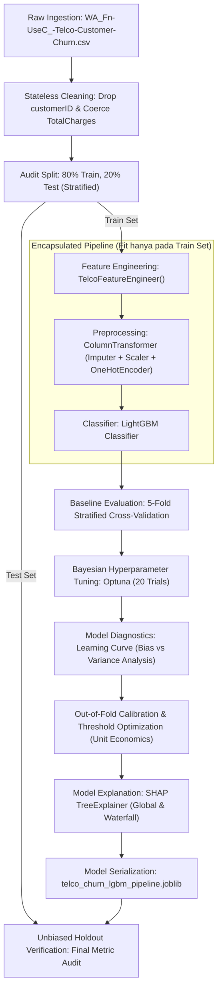

# Dokumentasi Metodologi & Spesifikasi Teknis: Telco Customer Churn Pipeline

Dokumen ini menjelaskan secara komprehensif alur kerja analitik, arsitektur pipeline, kamus data dan variabel, protokol pencegahan *data leakage*, serta metodologi evaluasi teknis dan finansial yang diimplementasikan pada proyek **Telco Customer Churn Classification**.

---

## 1. Ringkasan Eksekutif & Tujuan Proyek

*Customer Churn* (perpindahan pelanggan ke kompetitor) merupakan risiko finansial utama bagi penyedia jasa telekomunikasi. Tujuan utama dari pipeline machine learning ini adalah:
1. **Prediktif Akurat**: Membangun model probabilistik yang mengidentifikasi pelanggan berisiko tinggi churn secara andal (*state-of-the-art ranking metrics*).
2. **Bebas Kebocoran Data (*Zero Data Leakage*)**: Menerapkan arsitektur `sklearn.pipeline.Pipeline` yang mengenkapsulasi seluruh langkah rekayasa fitur dan pra-pemrosesan data secara terisolasi.
3. **Penyelarasan Bisnis & Finansial**: Mengganti ambang batas default ($0.50$) yang arbitrer dengan *profit-driven threshold optimization* berdasarkan simulasi *unit economics* retensi pelanggan.
4. **Keterjelasan Model (*Explainable AI*)**: Menyediakan interpretasi berbasis teori permainan kooperatif menggunakan nilai SHAP (*SHapley Additive exPlanations*) untuk dasar pengambilan keputusan operasional.

---

## 2. Alur Kerja End-to-End (Workflow Architecture)

Proses pemodelan dirancang secara berurutan dan terstandarisasi untuk menjamin reproduktibilitas:



---

## 3. Deskripsi Data & Kamus Variabel

### 3.1 Metadata Dataset Mentah
* **Sumber Data**: IBM Cognos Analytics / Kaggle Telco Customer Churn Dataset (`WA_Fn-UseC_-Telco-Customer-Churn.csv`).
* **Jumlah Observasi**: 7.043 pelanggan.
* **Jumlah Kolom Awal**: 21 variabel (1 target, 1 ID, 19 fitur).
* **Distribusi Target (`Churn`)**:
  * Kelas 0 (`No` - Bertahan): 5.174 baris (**73.46%**)
  * Kelas 1 (`Yes` - Churn): 1.869 baris (**26.54%**)
  * Kondisi: *Moderate class imbalance* (~1:3).

### 3.2 Pembersihan Data Awal (*Stateless Cleaning*)
1. `customerID`: Dihapus dari dataset karena merupakan ID arbitrer alfanumerik acak tanpa nilai prediktif.
2. `TotalCharges`: Mengandung 11 observasi string spasi kosong (`" "`) untuk pelanggan dengan masa langganan `tenure = 0`. Variabel dikonversi secara eksplisit ke numerik (`float64`) dengan mengganti spasi kosong menjadi `np.nan`.

---

### 3.3 Kamus Variabel Asli (Original Variables)

| Nama Variabel | Tipe Data Awal | Deskripsi Teknis | Rentang Nilai / Kategori |
| :--- | :--- | :--- | :--- |
| **`gender`** | Kategorikal | Jenis kelamin pelanggan | `Male`, `Female` |
| **`SeniorCitizen`** | Biner (0/1) | Indikator apakah pelanggan berusia lanjut | `0` (Tidak), `1` (Ya) |
| **`Partner`** | Kategorikal | Apakah pelanggan memiliki pasangan | `Yes`, `No` |
| **`Dependents`** | Kategorikal | Apakah pelanggan memiliki tanggungan | `Yes`, `No` |
| **`tenure`** | Numerik (Integer) | Lama waktu berlangganan dalam hitungan bulan | `0` – `72` bulan |
| **`PhoneService`** | Kategorikal | Apakah pelanggan berlangganan telepon rumah | `Yes`, `No` |
| **`MultipleLines`** | Kategorikal | Apakah memiliki multi-saluran telepon | `Yes`, `No`, `No phone service` |
| **`InternetService`** | Kategorikal | Jenis koneksi internet yang digunakan | `DSL`, `Fiber optic`, `No` |
| **`OnlineSecurity`** | Kategorikal | Layanan proteksi keamanan siber | `Yes`, `No`, `No internet service` |
| **`OnlineBackup`** | Kategorikal | Layanan pencadangan data online | `Yes`, `No`, `No internet service` |
| **`DeviceProtection`** | Kategorikal | Asuransi/proteksi kerusakan perangkat | `Yes`, `No`, `No internet service` |
| **`TechSupport`** | Kategorikal | Layanan prioritas dukungan teknis | `Yes`, `No`, `No internet service` |
| **`StreamingTV`** | Kategorikal | Layanan streaming siaran televisi | `Yes`, `No`, `No internet service` |
| **`StreamingMovies`** | Kategorikal | Layanan streaming film bioskop | `Yes`, `No`, `No internet service` |
| **`Contract`** | Kategorikal | Durasi dan skema komitmen kontrak | `Month-to-month`, `One year`, `Two year` |
| **`PaperlessBilling`** | Kategorikal | Pilihan tagihan digital tanpa kertas | `Yes`, `No` |
| **`PaymentMethod`** | Kategorikal | Opsi metode pembayaran bulanan | `Electronic check`, `Mailed check`, `Bank transfer (automatic)`, `Credit card (automatic)` |
| **`MonthlyCharges`** | Numerik (Float) | Besaran tagihan pelanggan saat ini per bulan | `$18.25` – `$118.75` |
| **`TotalCharges`** | Numerik (Float) | Akumulasi total pembayaran selama berlangganan | `$18.80` – `$8,684.80` |
| **`Churn`** *(Target)* | Kategorikal | Status pemutusan layanan (keluar dari provider) | `Yes` (1), `No` (0) |

---

### 3.4 Kamus Variabel Rekayasa Fitur (`TelcoFeatureEngineer`)

Empat variabel baru direkayasa untuk menangkap perilaku (*customer behavioral friction & stickiness*):

| Nama Variabel Baru | Formula Matematis | Rasionalisasi & Perilaku Empiris |
| :--- | :--- | :--- |
| **`TotalServices`** | $\sum_{i=1}^{8} \mathbb{I}(\text{Service}_i == \text{'Yes'})$ | Menghitung total add-on aktif dari 8 layanan (`PhoneService`, `MultipleLines`, `OnlineSecurity`, `OnlineBackup`, `DeviceProtection`, `TechSupport`, `StreamingTV`, `StreamingMovies`). Distribusi empiris menunjukkan churn tinggi pada 0 add-on (43.8%) dan churn terendah (<12%) pada 7–8 add-on terintegrasi. |
| **`AverageMonthlyCost`** | $\frac{\text{TotalCharges}}{\max(\text{tenure}, 1)}$ | Pengeluaran rata-rata historis riil per bulan. Masuk ke dalam **Peringkat #8 SHAP feature importance**, menjadi representasi pengeluaran yang lebih stabil dibandingkan tagihan statis bulan berjalan. |
| **`MonthlyChargesRatio`** | $\frac{\text{MonthlyCharges}}{\text{AverageMonthlyCost}}$ | Mendeteksi anomali kenaikan harga mendadak (*price shock*). Berdasarkan audit statistik, rasionya berpusat di sekitar $1.00$ karena mayoritas tagihan telco bersifat flat ($r \approx +0.012$). |
| **`TenureGroup`** | Discretization bins: `[-1, 12, 24, 48, 100]` | Segmentasi kohort masa berlangganan: `New` (0–12 bulan), `Growing` (13–24 bulan), `Mature` (25–48 bulan), `Loyal` (49–72 bulan). |

---

## 4. Pra-Pemrosesan & Partisi Data (*Data Audit Protocol*)

### 4.1 Pemisahan Data Terisolasi (*Train-Test Split*)
* **Protokol:** Data dipartisi sebelum transformer apapun melakukan fitting:
  * Proporsi: **80% Training Set** (5.634 observasi) dan **20% Test Set** (1.409 observasi).
  * Strategi: `StratifiedKFold(shuffle=True, random_state=42)` untuk memastikan rasio kelas target pada *training set* dan *test set* identik tepat pada **26.54%**.

### 4.2 Skema Transformasi Fitur (`ColumnTransformer`)
Pipeline memproses 23 fitur turunan ke dalam 2 jalur transformer independen:
1. **Fitur Numerik (6 fitur)**:
   * Fitur: `tenure`, `MonthlyCharges`, `TotalCharges`, `TotalServices`, `AverageMonthlyCost`, `MonthlyChargesRatio`.
   * Imputasi: `SimpleImputer(strategy='median')` (nilai median dihitung eksklusif dari training fold).
   * Penskalaan: `StandardScaler()` (menstandarkan fitur ke mean 0 dan variansi 1).
2. **Fitur Kategorikal (17 fitur)**:
   * Fitur: `gender`, `SeniorCitizen`, `Partner`, `Dependents`, `PhoneService`, `MultipleLines`, `InternetService`, `OnlineSecurity`, `OnlineBackup`, `DeviceProtection`, `TechSupport`, `StreamingTV`, `StreamingMovies`, `Contract`, `PaperlessBilling`, `PaymentMethod`, `TenureGroup`.
   * Enkoding: `OneHotEncoder(drop='first', sparse_output=False, handle_unknown='ignore')`.

---

## 5. Metodologi Eksperimen & Pemilihan Algoritma

### 5.1 Benchmarking AutoML Awal (PyCaret 10-Fold CV)
Untuk menghindari bias subjektif dalam pemilihan algoritma, dilakukan uji pembanding terstandardisasi pada training set:

| Peringkat | Algoritma | Mean CV ROC-AUC | Mean CV F1-Score | Recall | Precision |
| :---: | :--- | :---: | :---: | :---: | :---: |
| 1 | **Light Gradient Boosting Machine (LightGBM)** | **0.8468** | 0.6032 | 0.5487 | 0.6708 |
| 2 | Gradient Boosting Classifier | 0.8466 | 0.5971 | 0.5375 | 0.6724 |
| 3 | Logistic Regression | 0.8447 | 0.6063 | 0.5513 | 0.6745 |
| 4 | CatBoost Classifier | 0.8436 | 0.5985 | 0.5367 | 0.6775 |
| 5 | AdaBoost Classifier | 0.8427 | 0.6053 | 0.5522 | 0.6706 |
| 6 | XGBoost (Extreme Gradient Boosting) | 0.8247 | 0.5694 | 0.5116 | 0.6430 |
| 7 | Random Forest Classifier | 0.8226 | 0.5615 | 0.4902 | 0.6582 |

**Evaluasi Lanjutan (PyCaret Tuning vs Custom Pipeline):**
Eksperimen *tuning* otomatis di PyCaret menunjukkan bahwa algoritma **Gradient Boosting Classifier (GBC)** dengan fitur mentah mampu mencapai AUC $\approx 0.8509$. Meskipun angka ini secara marginal sedikit lebih tinggi ($\approx 0.006$) dibandingkan dengan *Custom Pipeline LightGBM* kita, kita sengaja memilih untuk **tidak menggunakan PyCaret GBC** untuk tahap akhir produksi, dengan alasan:
1. **Multikolinearitas Tersembunyi**: PyCaret GBC menggunakan fitur mentah (`TotalCharges` dan `MonthlyCharges`) yang sangat berkorelasi. Untuk pelaporan bisnis, kita butuh fitur yang direkayasa agar bebas multikolinearitas (seperti `AverageMonthlyCost` di *custom pipeline*).
2. **Keterjelasan Arah (Explainable AI)**: Plot *Feature Importance* bawaan GBC/PyCaret hanya menunjukkan besaran impak tanpa arah (apakah menaikkan atau menurunkan risiko churn). Model LightGBM murni tanpa dibungkus *wrapper* PyCaret terjamin kompatibilitasnya 100% dengan **SHAP TreeExplainer** yang esensial untuk menjawab pertanyaan "mengapa" secara arah dan log-odds.
3. **Efisiensi Komputasi**: Algoritma *histogram-based decision tree* (LightGBM) jauh lebih efisien untuk proses *thresholding* kustom yang intensif.

---

### 5.2 Optimasi Hyperparameter Bayesian (Optuna)
Model dioptimasi menggunakan Bayesian Optimization via Optuna sebanyak 20 trial dengan metrik objektif **5-Fold Stratified CV ROC-AUC**:

```python
# Ruang Pencarian (Search Space) Hyperparameter
param_space = {
    'n_estimators': trial.suggest_int('n_estimators', 80, 250),
    'learning_rate': trial.suggest_float('learning_rate', 0.01, 0.15, log=True),
    'num_leaves': trial.suggest_int('num_leaves', 15, 63),
    'max_depth': trial.suggest_int('max_depth', 3, 8),
    'min_child_samples': trial.suggest_int('min_child_samples', 10, 50),
    'subsample': trial.suggest_float('subsample', 0.6, 1.0),
    'colsample_bytree': trial.suggest_float('colsample_bytree', 0.6, 1.0),
    'reg_alpha': trial.suggest_float('reg_alpha', 1e-3, 10.0, log=True),
    'reg_lambda': trial.suggest_float('reg_lambda', 1e-3, 10.0, log=True)
}
```

Hasil optimasi menghasilkan parameter terbaik dengan **Mean CV ROC-AUC = 0.8443 (±0.0118)**.

---

## 6. Diagnostik Model & Validasi Empiris

### 6.1 Analisis Kurva Pembelajaran (*Learning Curve Analysis*)
Untuk memastikan model tidak mengalami *severe overfitting* atau *high bias*:
* Diuji pada 5 titik ukuran sampel training (10%, 32%, 55%, 77%, 100%).
* **Observasi**:
  * Skor Training AUC stabil pada $\approx 0.89$.
  * Skor Validation AUC konvergen pada $\approx 0.84$.
  * Selisih generalisasi (*generalization gap*) $\approx 0.05$ adalah wajar pada model berbasis ensemble gradient boosting dan membuktikan model stabil terhadap variasi data baru.

---

### 6.2 Optimasi Ambang Batas Berbasis Finansial (*Unit Economics Optimization*)
Dalam bisnis nyata, kesalahan klasifikasi memiliki konsekuensi biaya yang asimetris:
* **False Negative (FN)**: Pelanggan churn yang tidak terdeteksi $\rightarrow$ Kehilangan Customer Lifetime Value (CLV).
* **False Positive (FP)**: Pelanggan loyal yang salah diklasifikasikan sebagai churn $\rightarrow$ Terbuangnya biaya intervensi retensi/voucher promosi.

#### Model Simulasi Finansial:
$$\text{Expected Net Profit} = (\text{TP} \times \text{Saved CLV} \times \text{Acceptance Rate}) - ((\text{TP} + \text{FP}) \times \text{Cost per Intervention})$$

* **Parameter Simulasi**:
  * Biaya Intervensi Promosi: $\$20$
  * Nilai CLV yang Diselamatkan: $\$100$
  * Tingkat Keberhasilan Penawaran (*Acceptance Rate*): $50\%$
* **Hasil Evaluasi**:
  * Ambang Batas Default ($0.50$): Banyak churner terlewatkan (*Recall* rendah $\approx 0.52$).
  * Ambang Batas Finansial Optimal ($\approx 0.24$): Memaksimalkan estimasi profit bersih, meningkatkan deteksi churner (*Recall* naik ke $\approx 0.78$–$0.80$) dengan trade-off penurunan presisi yang terkontrol secara ekonomis.

---

### 6.3 Interpretasi Model Berbasis SHAP (Explainable AI)
Berdasarkan nilai rata-rata absolut SHAP ($|\text{SHAP}|$):
1. **`Contract_Two year` & `Contract_One year`**: Pendorong loyalitas terkuat (menggeser log-odds probabilitas churn ke arah negatif secara drastis).
2. **`tenure`**: Korelasi non-linear kuat di mana pelanggan dengan masa aktif awal (<12 bulan) memiliki risiko churn tertinggi.
3. **`InternetService_Fiber optic`**: Pendorong churn positif terkuat karena tingginya tagihan bulanan.
4. **`PaymentMethod_Electronic check`**: Friksi operasional pembayaran non-otomatis berkorelasi signifikan dengan peningkatan churn.
5. **`AverageMonthlyCost`**: Fitur rekayasa kustom yang menempati peringkat ke-8 fitur terpenting, membuktikan relevansinya terhadap performa model.

---

## 7. Struktur Artefak & Kesiapan Produksi

Pipeline model akhir disimpan secara utuh dalam satu objek joblib yang siap dideploy:
* **File**: `telco_churn_lgbm_pipeline.joblib`
* **Struktur Objek**:
  ```python
  Pipeline(steps=[
      ('fe', TelcoFeatureEngineer()),
      ('prep', ColumnTransformer(steps=[...])),
      ('clf', LGBMClassifier(...))
  ])
  ```
* **Karakteristik Inferensi**:
  Dapat menerima data mentah pelanggan baru berbentuk DataFrame pandas langsung (tanpa perlu pra-pemrosesan manual dari pihak client) dan menghasilkan probabilitas churn secara instan via `pipeline.predict_proba(df_new)[:, 1]`.
