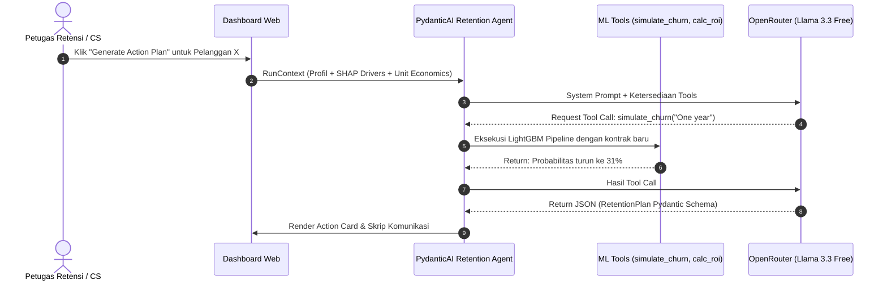

# System Design & Architecture Document: Telco Churn Intelligent Retention Platform (Phase 2)

**Author:** Antigravity AI & Arfiadi  
**Date:** October 2026  
**Status:** Approved Architecture Plan  
**Target Project:** `Telco Churn Classification & Decisioning`  

---

## 1. Executive Summary & Vision

Pada **Fase 1**, repositori telah distandarisasi ke tingkat kesiapan produksi (*production-grade*):
1. Seluruh transformasi fitur dienkapsulasi dalam modular `src/transformers.py` yang bebas dari kebocoran data (*zero data leakage*).
2. Model **LightGBM** telah dioptimalkan secara Bayesian menggunakan Optuna (Holdout ROC-AUC: `0.8447`).
3. Kebijakan klasifikasi telah dialihkan dari metrik probabilistik generik ($\tau = 0.50$) ke **Profit-Driven Thresholding** ($\tau^* = 0.39$) yang memaksimalkan *Expected Net Value* retensi.

**Fase 2 mentransformasi model prediktif ini menjadi sistem operasional cerdas (*Intelligent Retention Platform*)**:
> **Visi:** Bukan hanya menjawab *"Siapa yang berisiko churn?"*, melainkan memberikan diagnosis *"Mengapa mereka ingin pergi?"* (via TreeSHAP) dan secara otomatis merumuskan *"Tindakan intervensi apa yang paling menguntungkan serta personal?"* (via Agentic AI Retention Copilot dengan *business guardrails*).

---

## 2. System Requirements (SRS)

### 2.1. Functional Requirements (FR)

| ID | Modul | Deskripsi Kebutuhan |
| :--- | :--- | :--- |
| **FR-1** | **Single Customer Simulator** | Input interaktif untuk parameter pelanggan (kontrak, tagihan, layanan proteksi, tenure) dengan kalkulasi probabilitas churn real-time. |
| **FR-2** | **Profit-Driven Decision Engine** | Evaluasi probabilitas terhadap ambang batas dinamis $\tau^* = 0.39$ atau custom slider, menampilkan rekomendasi tindakan: *"Intervene"* vs *"Do Not Intervene"*. |
| **FR-3** | **Explainable AI (XAI) Visualizer** | Visualisasi kontribusi fitur lokal (*SHAP Waterfall Plot*) untuk setiap pelanggan individu, menyorot 3 faktor pendorong risiko (*risk drivers*) dan faktor pelindung (*protective factors*). |
| **FR-4** | **What-If Scenario Sandbox** | Kemampuan mengubah satu atau beberapa fitur (misal: memindahkan pelanggan dari *Month-to-month* ke *1-Year Contract* atau menambahkan paket *TechSupport*) dan langsung mengamati penurunan probabilitas churn secara real-time. |
| **FR-5** | **Agentic Retention Copilot** | LLM Agent terintegrasi yang menerima profil pelanggan + Top SHAP drivers, lalu menghasilkan draf strategi retensi personal (pesan penawaran, skrip agen CS, rekomendasi diskon/bundling) yang terkunci pada batasan budget unit economics ($\le \$20$). |
| **FR-6** | **Batch Analysis & Priority Queue** | Kemampuan mengunggah file CSV daftar pelanggan, menghasilkan skor risiko batch, dan mengurutkan pelanggan berdasarkan *Expected Loss* ($P(\text{churn}) \times \text{CLV}$) untuk antrean kerja tim retensi. |
| **FR-7** | **Report & Brief Generator** | Ekspor ringkasan strategi retensi pelanggan ke format PDF/Markdown siap pakai untuk tim operasional *Customer Success*. |

### 2.2. Non-Functional Requirements (NFR)

* **NFR-1 (Latency):**
  * Inferensi pipeline ML: $\le 100 \text{ ms}$ per inferensi tunggal.
  * Komputasi SHAP lokal: $\le 250 \text{ ms}$ menggunakan pra-inisialisasi `TreeExplainer`.
  * Generasi respons LLM Copilot: Menggunakan antarmuka streaming (*token streaming*) dengan waktu latensi awal (TTFT) $\le 1.5 \text{ detik}$.
* **NFR-2 (Resource Constraints & Local-First):**
  * Ringan CPU dan RAM-constrained: Seluruh komputasi inferensi dan SHAP harus berjalan efisien di CPU tanpa ketergantungan GPU (CUDA).
  * Penggunaan memori dasar aplikasi web: $\le 500 \text{ MB}$.
* **NFR-3 (Data Safety & Privacy):**
  * Stateless inference: Data pelanggan tidak boleh disimpan permanen di server pihak ketiga tanpa enkripsi.
  * PII masking: ID pelanggan dan data sensitif di-anonymize sebelum dikirim ke context window LLM.
  * API Keys (OpenAI / Gemini / Anthropic / OpenRouter) wajib dimuat via environment variable (`.env`), dilarang keras di-hardcode dalam kode.
* **NFR-4 (Modularity & Maintainability):**
  * Arsitektur modular memisahkan *Engine Core* (`src/`), *API/Service Layer*, dan *Presentation Layer*.

---

## 3. High-Level System Architecture

Arsitektur sistem dirancang dengan pendekatan **Clean Architecture** berlapis:

```mermaid
graph TD
    subgraph UI ["Presentation Layer (Web Interface)"]
        A1["Interactive Simulator<br/>(Feature Sliders & Inputs)"]
        A2["XAI Visualizer<br/>(SHAP Waterfall & Risk Gauges)"]
        A3["Batch Upload & Queue<br/>(Data Table & Sorting)"]
        A4["Retention Copilot Chat<br/>(Streaming Action Plan)"]
    end

    subgraph Service ["Application & Business Logic Layer"]
        B1["Inference Service<br/>(Validation & Pipeline Runner)"]
        B2["Decision & Profit Engine<br/>(Cost-Benefit Matrix & Threshold Tau)"]
        B3["XAI Service<br/>(TreeSHAP Pre-calculated Explainer)"]
        B4["Agentic Retention Engine<br/>(Prompt Templates & Guardrails)"]
    end

    subgraph Core ["Machine Learning Core (src/)"]
        C1["src.transformers<br/>TelcoFeatureEngineer"]
        C2["Pretrained Pipeline<br/>ColumnTransformer + LightGBM"]
        C3["Metadata & Config<br/>Threshold: 0.39, Feature Specs"]
    end

    subgraph External ["External Services & LLM Provider"]
        D1["OpenRouter API<br/>(Llama 3.3 / Gemini 2.0 Free)"]
    end

    A1 -->|Raw Input Payload| B1
    A2 -->|Request Explanation| B3
    A3 -->|Batch CSV| B1
    A4 -->|Trigger Action Plan| B4

    B1 --> C1
    C1 --> C2
    C2 --> B1
    B1 --> B2
    B2 --> A1

    B3 --> C2
    B3 --> A2

    B4 -->|Agentic Tool Calling + RunContext| D1
    D1 -->|Structured Validation (PydanticAI)| B4
    B4 --> A4
```

---

## 4. Detailed Component Design

### 4.1. Core Serving Pipeline (`InferenceService`)
* **Input Validation:** Skema Pydantic (`CustomerInputSchema`) memvalidasi seluruh 19 fitur mentah (tipe data, rentang nilai `tenure` $[0, 72]$, `MonthlyCharges` $[18, 120]$, dan nilai kategorial valid).
* **Pipeline Execution:** Model dimuat sekali saat startup (`joblib.load('models/telco_churn_lgbm_pipeline.joblib')`).
* **Output Payload:**
  ```json
  {
    "churn_probability": 0.7847,
    "optimal_threshold": 0.3900,
    "decision": "INTERVENE",
    "expected_loss": 588.52,
    "risk_level": "HIGH_RISK"
  }
  ```

### 4.2. Explainability Engine (`XAIService`)
* **Inisialisasi Caching:** `shap.TreeExplainer` diinisialisasi sekali dari step classifier LightGBM di dalam pipeline.
* **Transformasi Fitur:** Input mentah ditransformasikan terlebih dahulu melalui `pipeline[:-1]` untuk mendapatkan matriks numerik biner hasil One-Hot Encoding.
* **Ekstraksi Kontributor Utama:** Mengambil 3 fitur teratas dengan nilai SHAP positif tertinggi (*risk drivers*) dan 3 fitur dengan nilai SHAP paling negatif (*retention anchors*).
* Nilai-nilai ini diterjemahkan ke dalam bahasa bisnis yang manusiawi (misal: `"Contract = Month-to-month (+0.35 risiko)"`, `"TechSupport = No (+0.12 risiko)"`).

### 4.3. Agentic Retention Copilot (PydanticAI Agent)
Untuk mencegah "halusinasi", memvalidasi anggaran, dan memastikan keakuratan prediktif, agen AI diorkestrasi menggunakan **PydanticAI** dengan kapabilitas *Tool Calling*:



#### Struktur Prompt & Guardrail Contract:
1. **Financial Rule:** Biaya insentif atau voucher tidak boleh melebihi margin penghematan ($C \le \$20$).
2. **Contextual Target:** Penawaran harus secara spesifik menargetkan top SHAP driver pelanggan (contoh: jika churn dipicu oleh mahalnya tagihan *Fiber Optic*, tawarkan bundling *Security* gratis selama 3 bulan atau diskon tagihan flat $\$10$ dengan komitmen kontrak 1 tahun).
3. **Structured Response Format:**
   * **Root Cause Summary:** 2 kalimat penjelasan mengapa pelanggan ini ingin berhenti berlangganan.
   * **Recommended Retention Bundle:** Nama program, rincian benefit, estimasi biaya program.
   * **Custom Outreach Pitch:** Draf teks komunikasi (WhatsApp / Email / Telepon) dengan nada empati dan persuasif.
   * **Projected Probability After Intervention:** Estimasi penurunan churn jika pelanggan menerima tawaran.

---

## 5. Technology Stack & Framework Selection

Berdasarkan analisis kebutuhan, batasan biaya (100% Free), dan prinsip *Clean Architecture*, berikut adalah *Tech Stack* final yang disepakati untuk Fase 2:

| Layer | Teknologi | Alasan Pemilihan |
| :--- | :--- | :--- |
| **Presentation (UI)** | **Streamlit** | Sangat cepat dikembangkan (1-2 hari), render native untuk Matplotlib/SHAP, ringan di RAM/CPU, state management sederhana (`st.session_state`). |
| **ML Inference** | **LightGBM + Scikit-Learn** | Berjalan di CPU murni, latensi < 100ms, terenkapsulasi secara modular di `src/transformers.py`. |
| **Agentic Framework** | **PydanticAI** | Sangat ringan, type-safe, mendukung *Dependency Injection* (`RunContext`), dan *Native Tool Calling* tanpa overhead abstraksi seperti LangChain/LlamaIndex. |
| **LLM Gateway** | **OpenRouter API** | Gateway API gratis (tanpa kartu kredit) ke model open-source/closed-source kelas atas (Llama 3.3 70B, Gemini 2.0 Flash) via endpoint berstandar OpenAI. |

### Rekomendasi Arsitektur: **Hybrid Modular Design**
1. **Core Logic Terpisah di `src/`:** Seluruh logika bisnis, inferensi, kalkulasi profit, dan pembuatan prompt (PydanticAI agent) ditaruh di dalam modul `src/services/` sehingga **100% agnostic terhadap UI**.
2. **Offline Fallback:** Aplikasi akan dilengkapi dengan *Heuristic Rule-Engine* lokal sebagai cadangan jika API key OpenRouter kosong atau tidak ada koneksi internet, memastikan demo tidak pernah *crash*.

---

## 6. Detailed Implementation Roadmap

```
Phase 2 Execution Plan
├── Sprint 2.1: Foundation & Service Layer
│   ├── Buat src/services/inference_service.py (Validator Pydantic & Model Runner)
│   ├── Buat src/services/shap_service.py (TreeExplainer & Waterfall generator)
│   └── Buat src/services/agent_service.py (LLM Prompt Templates & Guardrails)
│
├── Sprint 2.2: Streamlit Interactive Web Application
│   ├── Bangun UI Layout: Sidebar Configuration, KPI Cards, Status Gauges
│   ├── Tab 1: Single Customer Risk Profiler & Interactive What-If Sandbox
│   ├── Tab 2: Batch Churn Analysis & Work Queue Table
│   └── Tab 3: Model Governance, Performance & Cost-Benefit Calibration
│
├── Sprint 2.3: Agentic Copilot Integration
│   ├── Konfigurasi OpenRouter API via .env & PydanticAI Setup
│   ├── Real-time Streaming UI untuk Retention Action Plan
│   └── Exportable Retention Brief (Download Markdown/Text)
│
├── Sprint 2.4: Testing & Documentation
│   ├── Unit test untuk service layer
│   └── Panduan pengoperasian aplikasi di README.md
```

---

## 7. Status Eksekusi

Desain arsitektur ini telah **disetujui**.
Langkah selanjutnya adalah memulai implementasi sesuai panduan teknis pada `docs/agentic_ai_implementation_plan.md`.
